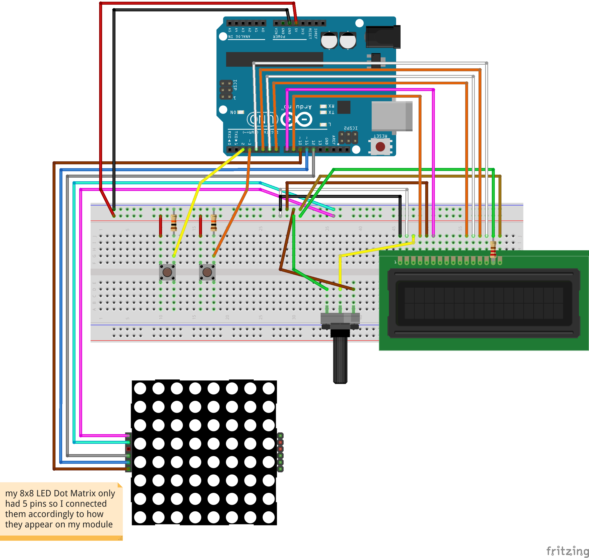

# 2_uzduotis

## components used in the circuit

- 2 push buttons
- 2 resistors of 10K Ω each
- 1 resistor of 100-150 Ω
- 8x8 led dot matrix
- 16x2 LCD screen
- potenciometer
- bunch of jumper wires

## schematics

