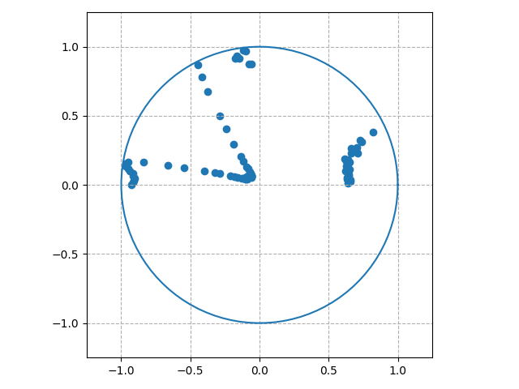
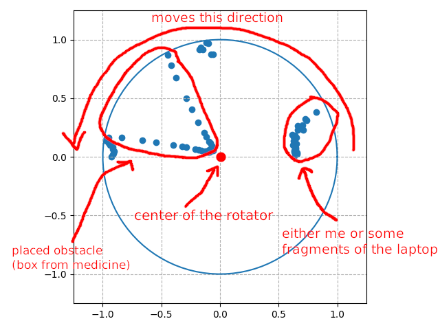

# map-env

connects to Arduino through Serial, reads the values GY-VL53L0XV2 module manages to scan by being rotated 180 degrees counterclockwise, and graphically displays the gathered results

## results

the script manages to produce the following graph:



and here's everything explained:



## dependencies

for Debian based distros, the following packages are required:

```
python3-matplotlib
python3-pip
```

and then through pip3 install this library:

```
pyserial
```

## running

```bash
python3.8 map-env.py
```
