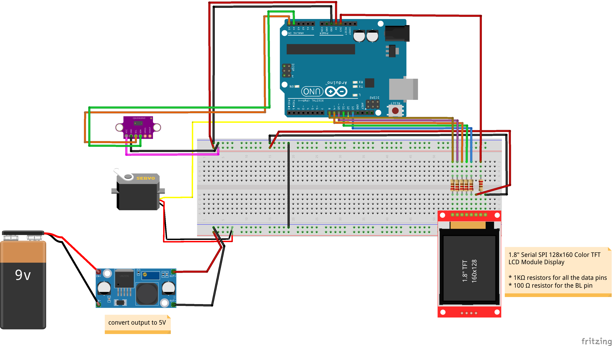

# 4_uzduotis

## components used in the circuit

- VL53L0X ToF sensor
- SG90 Micro Servo Motor
- 9V external power supply
- LM2596 Buck Step Down Power Converter
- 1.8" Serial SPI 128x160 Color TFT LCD Module Display
- 5 resistors of 1K Ω each
- 1 resistor of 100 Ω
- bunch of jumper wires

## schematics

