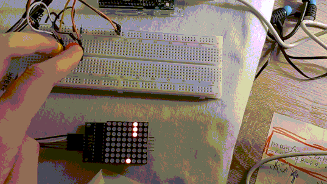

# arduino-lab
Lab works for the module "Introduction to Robotics"

## [1_uzduotis](/1_uzduotis)

An interactive game with 2 buttons that control the bottom dot. The goal is to avoid 3-dot-long falling objects. The button presses are triggered by interrupts.

## [2_uzduotis](/2_uzduotis)

An interactive game with 2 buttons that control the bottom dot + LCD display. The goal is to avoid 3-dot-long falling objects. The code is rewritten to be executed asynchronously; applied port manipulation.

## [3_uzduotis](/3_uzduotis)

I call this invention "maido roboto". It's goal is to scan the environment in 60 cm radius and when hooked up to the computer, a Python (3.8) program is run to produce accurate mapping of the surroundings.

The produced graph:

My explanation:

## [4_uzduotis](/4_uzduotis)

This time, "maido roboto" is advanced further to display the mapping of surroundings in real time in the TFT LCD display.

(`･ω･´)
